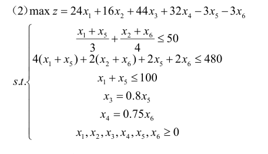
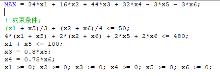
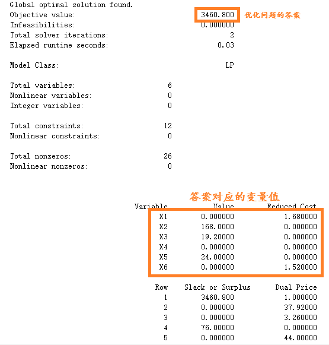

## Lingo主要作用

快速求解线性规划、非线性规划、线性和非线性方程组等

## 简单线性问题求解



这样的题目直接复述即可



结果如下



## 语法

### 基本用法&一些小点

* lingo中数学规划模型包含目标函数、决策变量、约束条件三个要素
* lingo中每一句都要用英文分号结束
* 以英文!开始注释，需要以英文分号结束
* 变量不区分字母大小写，要求以字母开头，后面可以有数字与下划线，不超过32个字符
* 定义好集合后的语句顺序是随意的
* 函数以@开头
* LINGO中各变量默认是非负的
* 偶尔莫名其妙出现的model报错，重启lingo后又没有了

### 集合

集合部分的语法为  
sets:  
集合名称1/成员列表1/：属性1_1，属性1_2，…，属性1_n1；  
集合名称2/成员列表2/：属性2_1，属性2_2，…，属性2_n2；  
派生集合名称（集合名称1，集合名称2）：属性3_1，…，属性3_n3；  
endsets 

eg:
```lingo
SETS:
    PRODUCTS /Prod1, Prod2, Prod3/: Profit;
    MACHINES /Mach1, Mach2, Mach3/: TimeAvailable;
    LINKS(PRODUCTS, MACHINES): TimeRequired;
ENDSETS
```
### 数据

数据部分的语法为  
data:  
属性1 = 数据列表;  
属性2 = 数据列表;  
enddata  

eg:
```lingo
DATA:
Profit = 300, 500, 200;
TimeAvailable = 40, 60, 50;
TimeRequired = 
    1.5, 2.0, 1.0,
    1.0, 1.5, 2.0,
    2.0, 1.0, 1.5;
ENDDATA
```

### 函数

#### 算术运算符

加减乘除乘方分别为`+` `-` `*` `/` `^`

#### 逻辑运算符

#not# 否定该操作数的逻辑值，＃not＃是一个一元运算符。  
#eq# 若两个运算数相等，则为 true；否则为 false。  
#ne# 若两个运算符不相等，则为 true；否则为 false。  
#gt# 若左边的运算符严格大于右边的运算符，则为 true；否则为 false。  
#ge# 若左边的运算符大于或等于右边的运算符，则为 true；否则为 false。  
#lt# 若左边的运算符严格小于右边的运算符，则为 true；否则为 false。  
#le# 若左边的运算符小于或等于右边的运算符，则为 true；否则为 false。  
#and# 仅当两个参数都为 true 时，结果为 true；否则为 false。  
#or# 仅当两个参数都为 false 时，结果为 false；否则为 true。

#### 常见数学函数

@abs(x)返回 x 的绝对值。  
@sin(x)返回 x 的正弦值，x 采用弧度制。  
@cos(x)返回 x 的余弦值。  
@tan(x)返回 x 的正切值。  
@exp(x)返回常数 e 的 x 次方。  
@log(x)返回 x 的自然对数。  
@lgm(x)返回 x 的 gamma 函数的自然对数。  
@mod(x,y)返回 x 除以 y 的余数。  
@sign(x)如果 x0 时返回 1，当 x=0 时返回 0。  
@floor(x)返回 x 的整数部分。当 x>=0 时，返回不超过 x 的最大整数；当 x<0 时，返回 不低于 x 的最大整数。  
@smax(x1,x2,…,xn)返回 x1，x2，…，xn 中的最大值。  
@smin(x1,x2,…,xn)返回 x1，x2，…，xn 中的最小值。

#### 变量界定函数
变量界定函数实现对变量取值范围的附加限制，共 4 种

@bin(x)限制 x 为 0 或 1；  
@bnd(L,x,U)限制 L≤x≤U；  
@free(x)取消对变量 x 的默认下界为 0 的限制，即 x 可以取任意实数；  
@gin(x)限制 x 为整数。

    在默认情况下，LINGO 规定变量是非负的，也就是说下界为 0，上界为+∞。@free 取 消了默认的下界为 0 的限制，使变量也可以取负值。@bnd 用于设定一个变量的上下界,也可以取消默认下界为 0 的约束。
#### 级循环函数
@for：该函数用来产生对集成员的约束。

@sum：该函数返回遍历指定的集成员的一个表达式的和。

@min 和@max：返回指定的集成员的一个表达式的最小值或最大值。