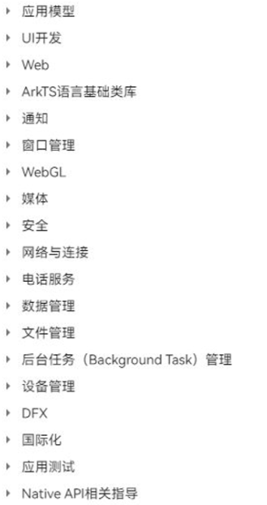
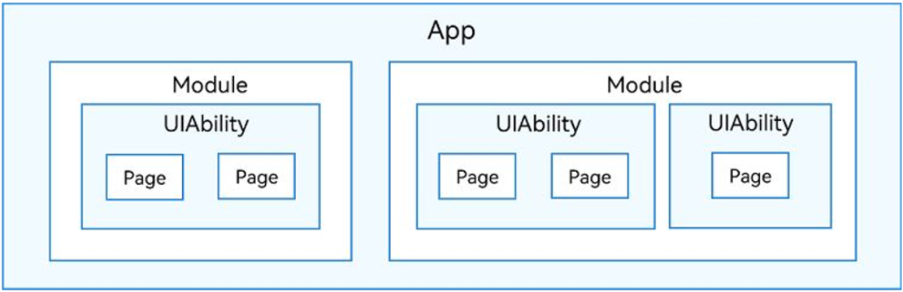
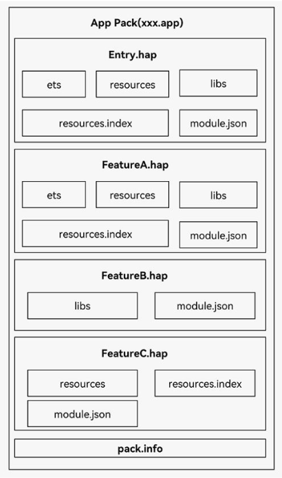

## 鸿蒙系统认知

### OpenHarmony与HarmonyOS

- HarmonyOS 是基于 OpenHarmonyOS 开发的商用发行版。
- HarmonyOS 包括三个部分： OpenHarmonyOS ，包括在内的闭源应用与服务，AOSP 等其他开放源代码。

## 鸿蒙开发基础

### 鸿蒙开发体系介绍

- 支撑应用的两个重要框架
  - 应用程序框架：Ability开发
  - UI框架：UI开发
- 开发工具：DevEco Studio

知识体系如下：

### Stage模型及包结构

Stage模型是HarmonyOS 3.1 Developer preview版本开始主推并长期演进的模型，早期版本的FA模型已不再主推

基于Stage模型开发的应用，经编译打包后，其应用程序包结构如图：

打包后的HAP包结构如图

- ets目录：存放应用代码编译后的字节码文件。
- libs目录：存放库文件。
- resources目录：存放应用的资源文件（字符串、图片等）
- resources.index：资源索引表，由IDE编译工程时生成。
- module.json：是HAP的配置文件，内容由工程配置中的moduIe.json5 和 app.json5 组成。
- pack.info：BundIe 中用于描述每个HAP属性的文件

### DevEco Studio

#### 下载安装 & 环境配置

1. 进入[DevEco Studio官网](https://developer.harmonyos.com/cn/develop/deveco-studio)下载对应版本  
2. 解压后运行安装脚本，根据提示完成安装
3. 打开DevEco，配置node.js与Ohpm
4. 在help-Diagnose Development Environment中可以诊断环境是否已经搭建完毕

#### 创建项目

依次选择`Create Project`->`Application`->`Empty Ability`->`Next`进入工程配置页

## 基于ArkTs的开发
## 常用组件及UI方法